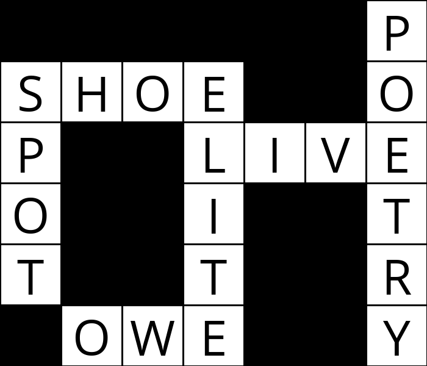

# CS50AI | Lecture 3 - Optimization | Project 3 - [Crossword](https://cs50.harvard.edu/ai/2024/projects/3/crossword/)

This project is a mandatory assignment from **CS50AI – Lecture 3: "Optimization"**. It involves solving a crossword puzzle using **constraint satisfaction problems (CSP)**, enforcing *node* and *arc consistency*, and utilizing *backtracking search* with *heuristics*.

---

## 📌 Usage

To run the project locally, follow these steps:

1. **Clone the Repository**  
   ```bash
   git clone https://github.com/your-username/cs50ai-crossword.git
   cd cs50ai-crossword
   ```

2. **Install Requirements**
   ```bash
   pip install Pillow
   ```
3. **Run the Project**  
   Execute the program using Python:
   ```bash
   python generate.py ./data/structureX.txt ./data/wordsX.txt [output.png]
   ```
   - `structure.txt`: The file defining the crossword grid.
   - `words.txt`: The file containing the list of words to be used.
   - `[output.png]` (optional): Filename to save the generated crossword as an image.

3. **View the Results**  
   - The solution (if found) will be printed in the terminal.
   - If an output file is specified, the crossword is saved as an image.

---

## Project Overview

In this project, the goal is to generate a crossword puzzle by solving a constraint satisfaction problem (CSP). The program:

- **Defines Variables and Domains**: Each word slot in the crossword grid is a variable, and the possible words that fit are its domain.
- **Enforces Node Consistency**: Ensures that word lengths match slot lengths.
- **Applies Arc Consistency (AC-3 Algorithm)**: Removes inconsistent values that do not satisfy overlapping constraints.
- **Uses Backtracking Search**: Assigns words to slots while maintaining consistency and applying heuristics.
- **Utilizes Heuristics**:
  - **Minimum Remaining Values (MRV)**: Prioritizes the most constrained variable.
  - **Degree Heuristic**: Breaks ties by selecting the variable with more constraints.
  - **Least Constraining Value (LCV)**: Orders words based on how many future choices they eliminate.
- **Implements Inference (Forward Checking)**: Maintains arc consistency after each assignment.

---

## My Task

- **Implemented Core CSP Functions:**
  - `enforce_node_consistency()`: Filters out words that do not match slot lengths.
  - `revise(x, y)`: Ensures consistency between overlapping slots.
  - `ac3()`: Applies the AC-3 algorithm to enforce arc consistency.
  - `backtrack()`: Uses backtracking search to find a valid assignment.
  - `select_unassigned_variable()`, `order_domain_values()`, and `inference()`: Apply heuristics for efficient search.

- **Handled Crossword Grid Representation:**
  - Converts the solution into a 2D letter grid.
  - Prints the solution in the terminal.
  - Saves the result as an image file.

- **Ensured Code Efficiency:**
  - Optimized the backtracking search with heuristics.
  - Applied forward checking to reduce search space.

---

## Implementation Explanation

### 1. Constraint Satisfaction Problem (CSP)
The crossword puzzle is modeled as a CSP:
- **Variables:** Word slots in the crossword grid.
- **Domains:** Possible words that fit each slot.
- **Constraints:**
  - Words must match slot lengths.
  - Overlapping letters must be consistent.
  - Words must be unique.

### 2. AC-3 Algorithm
AC-3 ensures arc consistency by iterating over variable pairs and removing values that do not have a valid counterpart.

### 3. Backtracking Search with Heuristics
The backtracking algorithm selects an unassigned variable using MRV, assigns values using LCV, and applies forward checking.

### 4. Output Generation
The final assignment is displayed in the terminal and saved as an image using PIL.

---

## Example Output
### Terminal Output
```
DOG  C 
O    A 
GIRAFFE
     E
```
### Image Output
An image representation of the crossword is saved if specified.



---

## Challenges & Learnings
- Implementing **AC-3 efficiently** to maintain arc consistency.
- Optimizing **backtracking search** with heuristics.
- Ensuring **proper visualization** of the crossword grid.

This project deepened my understanding of **constraint satisfaction problems (CSPs)** and **AI-based problem-solving techniques**.

